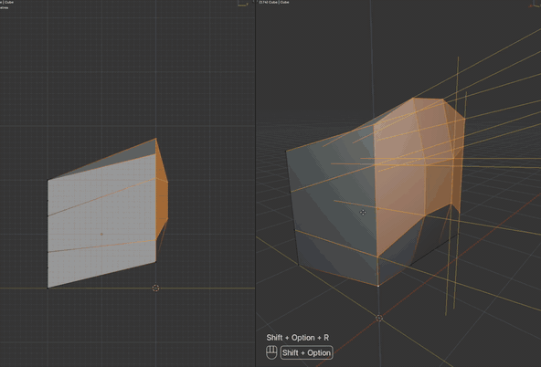

# Slide Rotate

Blender 5.1 Edit Mode operator: rotate or scale a vertex/edge/face selection around the current transform pivot while each vertex stays on a connected **guide rail**.

It should feel like native `R` or `S`, except vertices can only travel along automatically chosen surrounding edges (like a rotation- or scale-driven edge slide).

[Watch a walkthrough on YouTube](https://youtu.be/qDgqyUuwZWk)

[](https://youtu.be/qDgqyUuwZWk)

## Requirements

- Blender 5.1 or newer

## Installation

Download the zip from GitHub Releases (after a tagged ship), or use this checkout.

**From Disk:** Blender **Edit → Preferences → Get Extensions → Install from Disk**, then enable **Slide Rotate**.

**Development (no zip):**

```sh
./scripts/link-dev.sh
```

That symlinks this repo to `~/Library/Application Support/Blender/5.1/extensions/user_default/slide_rotate`. Enable **Slide Rotate** once. After edits, click **Reload Slide Rotate** at the bottom of the 3D View **Slide Rotate** sidebar (or F3). Watch the system console for `Slide Rotate: reloaded from disk`. Restart Blender after RNA property schema changes.

## Invoke

- Shortcut: **Shift+Alt+R** in Mesh Edit Mode opens the Slide pie. Flick toward Rotate or Scale, click, or tap **R** / **S**.
- Menu: **Mesh → Transform → Slide Rotate** / **Slide Scale**, also **Vertex** / **Edge**
- Search: **F3 → Slide**
- Sidebar: **3D View → Slide Rotate → Slide Rotate** / **Slide Scale**

Native `R` and `S` are unchanged. Shift+Alt+S remains To Sphere.

## Usage

1. Enter Edit Mode and select a loop, vertices, or edges.
2. Set the transform pivot (Median, 3D Cursor, Active Element, or Bounding Box Center).
3. Start Slide Rotate or Slide Scale and move the mouse like `R` or `S`.
4. Left-click or Enter confirms. Right-click or Esc cancels.

While dragging:

| Key | Action |
| --- | --- |
| Mouse | Rotate: angle around the projected pivot. Scale: signed factor from the invoke mouse radial |
| Shift | Precision (further motion only; does not jump back to the start pose) |
| Ctrl | Snap (rotate: scene 3D angle increment; scale: 0.1, or 0.01 with Shift) |
| C | Toggle Clamp / Extend Rails (extend is the default) |
| X / Y / Z | Axis lock like native `R` / `S` (orientation → Global/Local flip → View). Rails are re-chosen for the new axis. |
| 0–9, `.`, `-` | Type an angle in degrees (Rotate) or a scale factor (Scale) |
| Backspace | Edit typed input |

The 3D View header shows the angle or scale factor, axis, and clamp state. The status bar lists the same kind of modal keys as native `R` (confirm, cancel, Shift precision, Ctrl snap, C clamp, X/Y/Z). Yellow overlay lines are the cached rails. Locking X, Y, or Z also draws a thick anti-aliased infinite axis through the pivot, using the same colors as native `R` (theme **Axis X/Y/Z**, mixed toward light gray).

## Geometry

One shared parameter drives every vertex: an angle `theta` for Rotate, a scale `factor` for Scale. Each vertex is assigned a rail **once at invoke, and again if you lock X/Y/Z** (outgoing edges to unselected vertices, scored against the rotational tangent or the scale radial). Opposite colinear neighbors are merged into one bidirectional rail so Clamp works in both directions, like a mid-loop slide.

Vertices sitting inside a subdivided face often have no 1-ring edge in the rotation direction. If every connected neighbor is a poor match for the rotational tangent, Slide Rotate copies rails from the coplanar face island: edges that leave that surface (the through-edges the boundary already has). Those borrowed rails are scored the same way, so interior verts can slide with the face instead of crawling along in-face edges.

The rotate solver intersects the rotated radial line with the rail in the current rotation plane (view axis by default), then applies that parameter on the real 3D rail. If the intersection is parallel, near the pivot, or numerically explosive, it falls back to projecting the unconstrained rotated point onto the rail. Scale projects the unconstrained native-S pose (uniform from the pivot) onto the rail. With X/Y/Z lock, it instead slides each vertex along its rail until the locked coordinate matches native S — so Y-lock at scale 0 lands every vertex on the pivot's Y, even if the rail is slightly tilted. Vertices with no rail, or the active pivot vertex itself, stay still.

Coordinates are solved in world space and written back to BMesh local space so rotated and non-uniformly scaled objects stay correct.

## Limitations

- Individual Origins falls back to median.
- No Trackball (`R R`), geometry snapping, UV correction, proportional editing, or mid-gesture rail cycling.
- Selecting the entire connected mesh leaves no outgoing rails, so nothing moves.
- Simple numeric input only (no units or expressions).
- Custom transform orientations use the orientation matrix when Blender exposes it; Normal uses averaged selected vertex normals.

## Development tests

```sh
./scripts/run-unittests.sh
"/Applications/Blender 5.1.app/Contents/MacOS/blender" \
  --factory-startup -b --python scripts/validate_addon.py
```

See [AGENTS.md](AGENTS.md) for changelog and unit-test rules, and [MILESTONES.md](MILESTONES.md) for session progress.

## Release

On a clean `main`, with Unreleased changelog bullets and a GitHub `origin` remote:

```sh
./scripts/release.sh 0.1.0
```

That bumps `blender_manifest.toml` if needed, moves `## [Unreleased]` into a dated section, commits, tags `v0.1.0`, and pushes. The **Release** GitHub Action builds `slide_rotate-0.1.0.zip` with Blender’s extension builder and publishes it on the GitHub Release. Do not attach zips by hand unless Actions failed.

## Manual checks

- Grid: select a horizontal loop, Shift+Alt+R, pick Rotate (or tap R); vertices travel on vertical rails.
- Scale: select verts with outgoing edges away from the pivot, Shift+Alt+R, tap S; they slide along those radials.
- Subdivided face: select the face including interior verts; they follow the same through-rails as the boundary instead of in-face edges.
- Right/Front/Top ortho: free rotation is around the view axis (same as `R`).
- Press `X` / `Y` / `Z` while dragging; header follows View → orientation → Global/Local, and a thick anti-aliased axis line in native-R colors appears through the pivot.
- Axis lock still follows the mouse after orbiting 180° around the model (same as native `R`).
- Active Element pivot: the active vertex stays put.
- `C` clamps to the physical rail; default extend continues past the edge.
- Object with rotation and non-uniform scale still follows world-space rails.
- Esc restores the start pose; Undo after confirm is one step.
- Reload from the sidebar after a Python edit (linked checkout only).

## License

[GPL-3.0-or-later](LICENSE)
