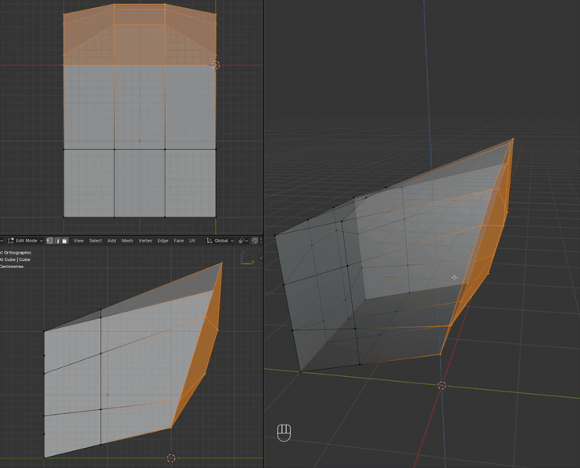
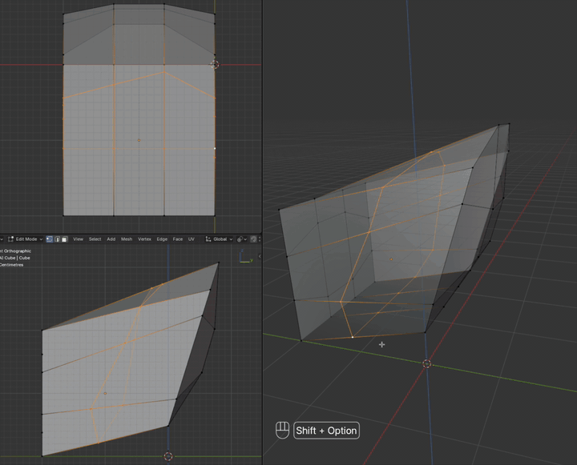
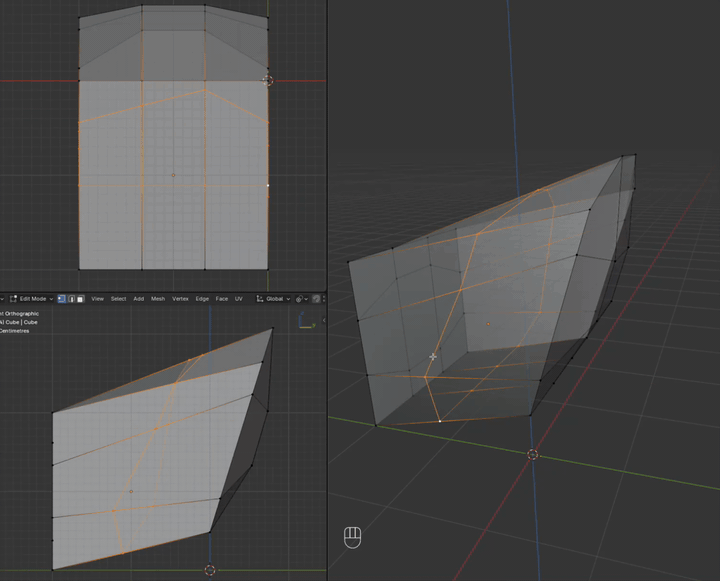

# Slide Tools

Blender 5.1 Edit Mode: rotate, scale, flatten, or curve a selection while each vertex stays on a connected **guide rail**.

It should feel like native `R` / `S`, or Loop Tools Flatten / Curve, except vertices can only travel along automatically chosen surrounding edges.

**Rotate**

**Scale**

**Flatten**

**Curve** slides a loop or path toward a fitted smooth line instead of a plane.

## Install

Blender 5.1 or newer. Download the zip from [GitHub Releases](https://github.com/soswow/blender-slide-tools/releases).

**Edit → Preferences → Get Extensions → Install from Disk**, then enable **Slide Tools**.

## Use

1. Edit Mode: select a loop, vertices, or edges.
2. Set the transform pivot (Median, 3D Cursor, Active Element, or Bounding Box Center).
3. **Shift+Alt+R** opens the Slide pie. Flick toward Rotate, Scale, Curve (bottom), or Flatten (top), click, or tap **R** / **S** / **C** / **F**.
4. Left-click or Enter confirms. Right-click or Esc cancels.

Also: **Mesh → Transform** (and Vertex / Edge menus), **F3 → Slide**, or the **Slide Tools** sidebar.

Native `R` and `S` are unchanged. Shift+Alt+S remains To Sphere.

Rotate and Scale follow the mouse like `R` / `S`. Flatten lands on the plane at invoke (factor 1); drag toward the pivot to ease off. Curve starts at the current pose (factor 0); drag away from the pivot toward 1 to approach the fitted line.

| Key | Action |
| --- | --- |
| Mouse | Rotate: angle around the projected pivot. Scale: signed factor from the invoke mouse radial. Flatten: same radial; invoke is 1 (on the plane), 0 at the pivot. Curve: same radial, but invoke is 0; drag away from the pivot toward 1 (clamped 0–1) |
| Shift | Precision (further motion only; does not jump back to the start pose) |
| Ctrl | Snap (rotate: scene 3D angle increment; scale: 0.1, or 0.01 with Shift) |
| C | Toggle Clamp / Extend Rails (extend is the default) |
| X / Y / Z | Axis lock like native `R` / `S`. Rails are re-chosen for the new axis. Flatten / Curve: lock is the fit plane through the pivot |
| `[` `]` or Wheel | Curve: lower or raise Order (how much shape the fitted line may keep) |
| 0–9, `.`, `-` | Type degrees (Rotate), a scale factor, or a flatten / curve factor (`1` is fully on the target) |
| Backspace | Edit typed input |

Yellow overlay lines are the cached rails. Curve also draws a light-blue fitted line. X/Y/Z lock also draws a thick axis through the pivot, colored like native `R`.

## Limitations

- Individual Origins falls back to median.
- No Trackball (`R R`), geometry snapping, UV correction, proportional editing, or mid-gesture rail cycling.
- Selecting more than one loop at once is poorly defined: rails and the shared pivot often fight, so motion can look unclear or uneven. Curve fits each chain on its own, still with one shared factor.
- Selecting the entire connected mesh leaves no outgoing rails, so nothing moves.
- Curve needs a selected loop or path (verts connected to each other). Isolated verts stay put.
- Simple numeric input only (no units or expressions).
- Custom transform orientations use the orientation matrix when Blender exposes it; Normal uses averaged selected vertex normals.

## More

- [How rails and solvers work](docs/geometry.md)
- [Development](docs/development.md)
- [Release](docs/release.md)
- [Manual checks](docs/manual-checks.md)

## License

[GPL-3.0-or-later](LICENSE)
